# Meow there! 

    

## I'm Neha, a software developer.

You might find me talking to a cat or weeping.

- 🔭 I’m currently working with Node.js and friends :)
- 🌱 I’m currently learning a lot of things.
- 💬 Ask me about anything. Let's google together ^ \_ ^
- 📫 How to reach me: <a href="https://github.com/neha-ajith/neha-ajith/issues/new">Here</a>
- 😄 Pronouns: She/her 🏳‍🌈
- ⚡ Fun fact: I'm a cat trapped in a human being's body.

### Find me on:

## Languages Used

<a href = '#'>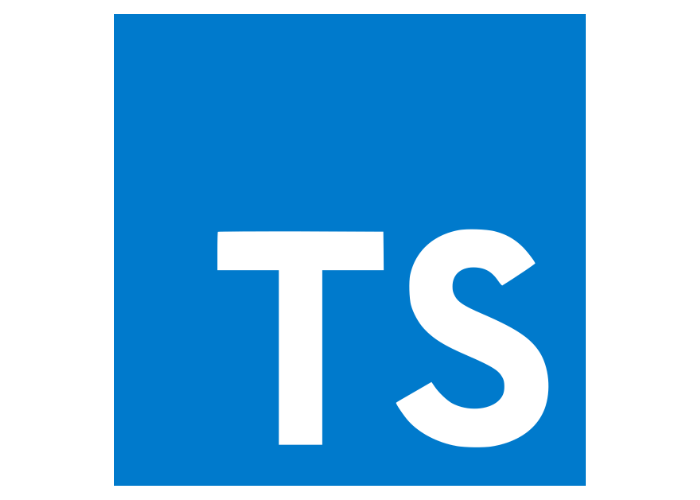</a>
<a href = '#'>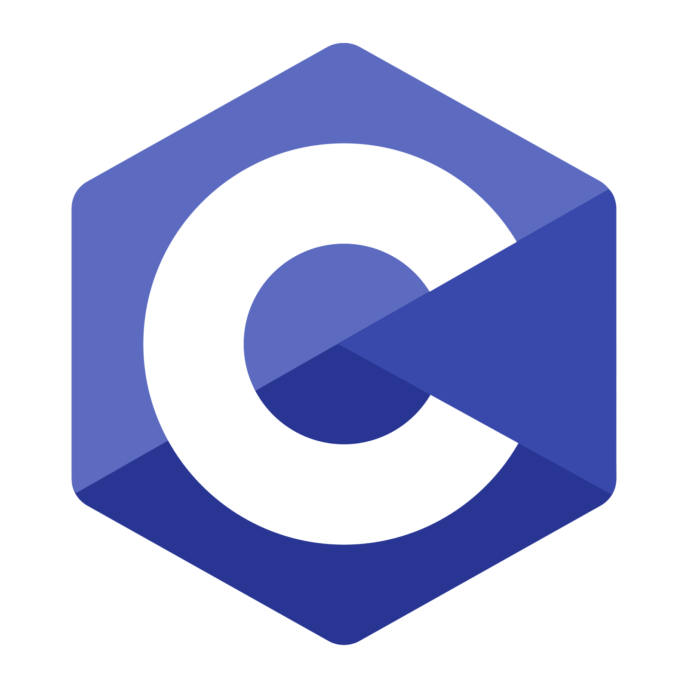</a>
<a href = '#'>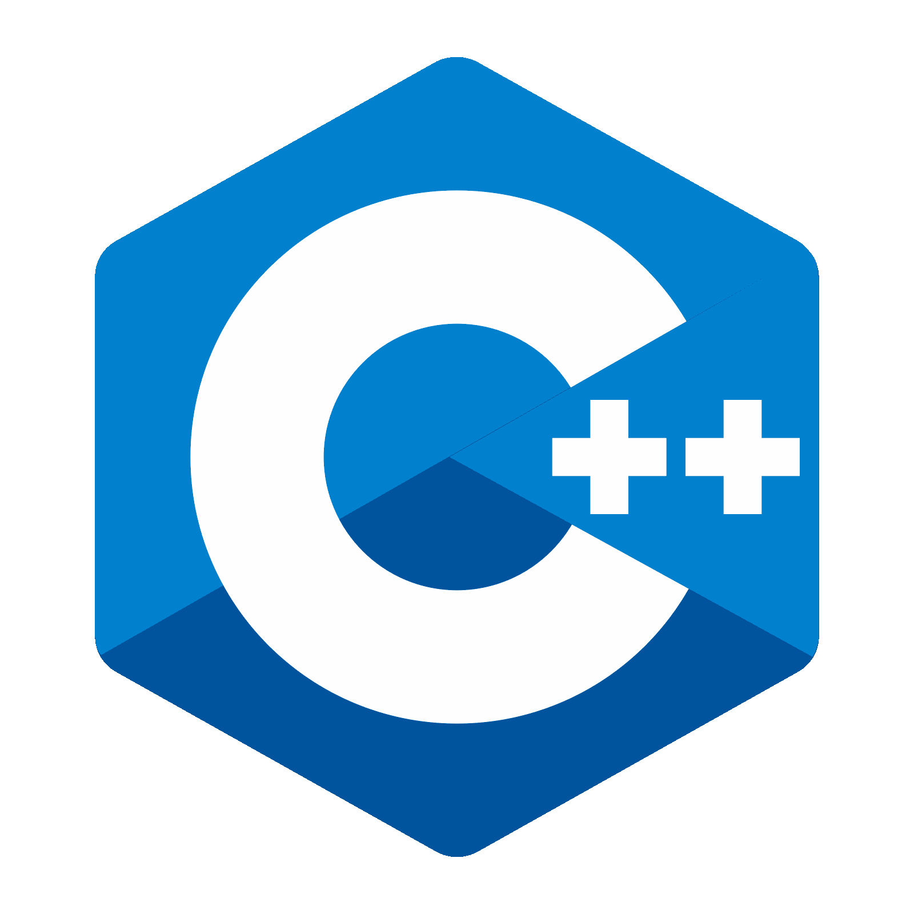</a>
<a href = '#'>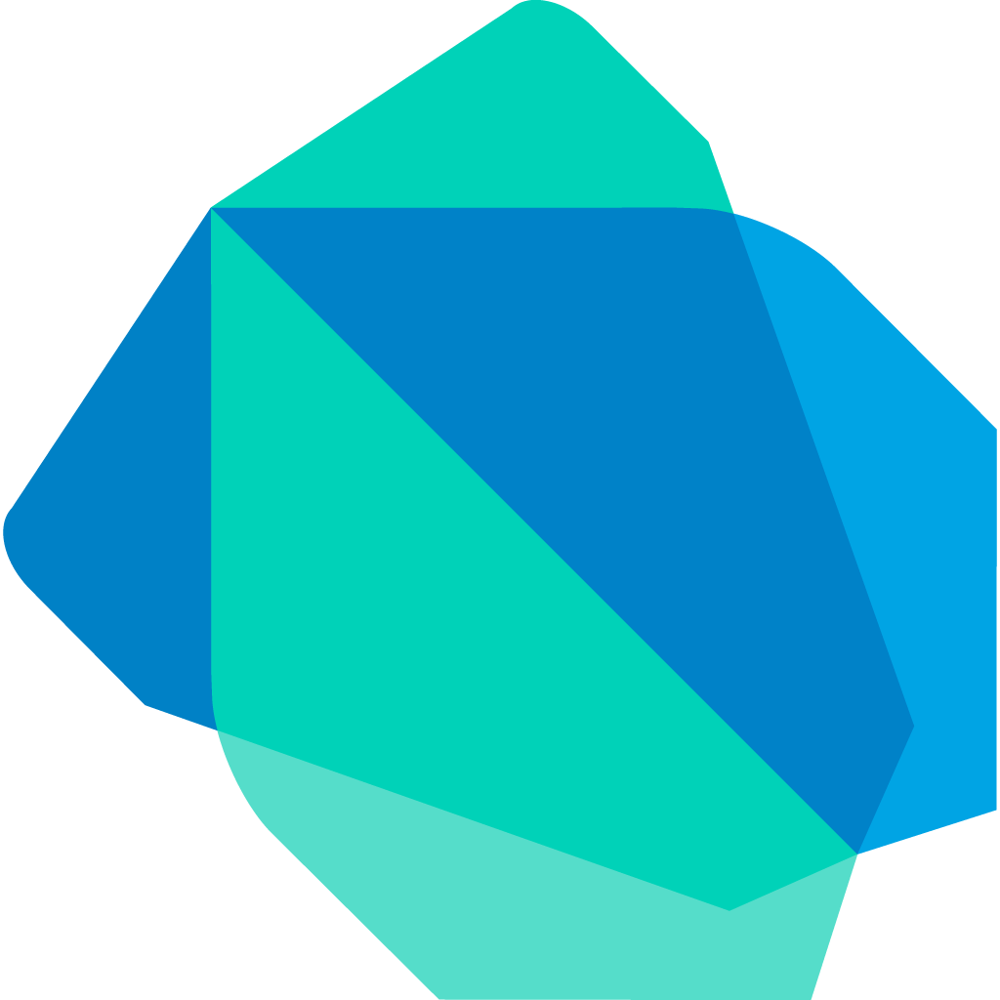</a>

<a href = '#'>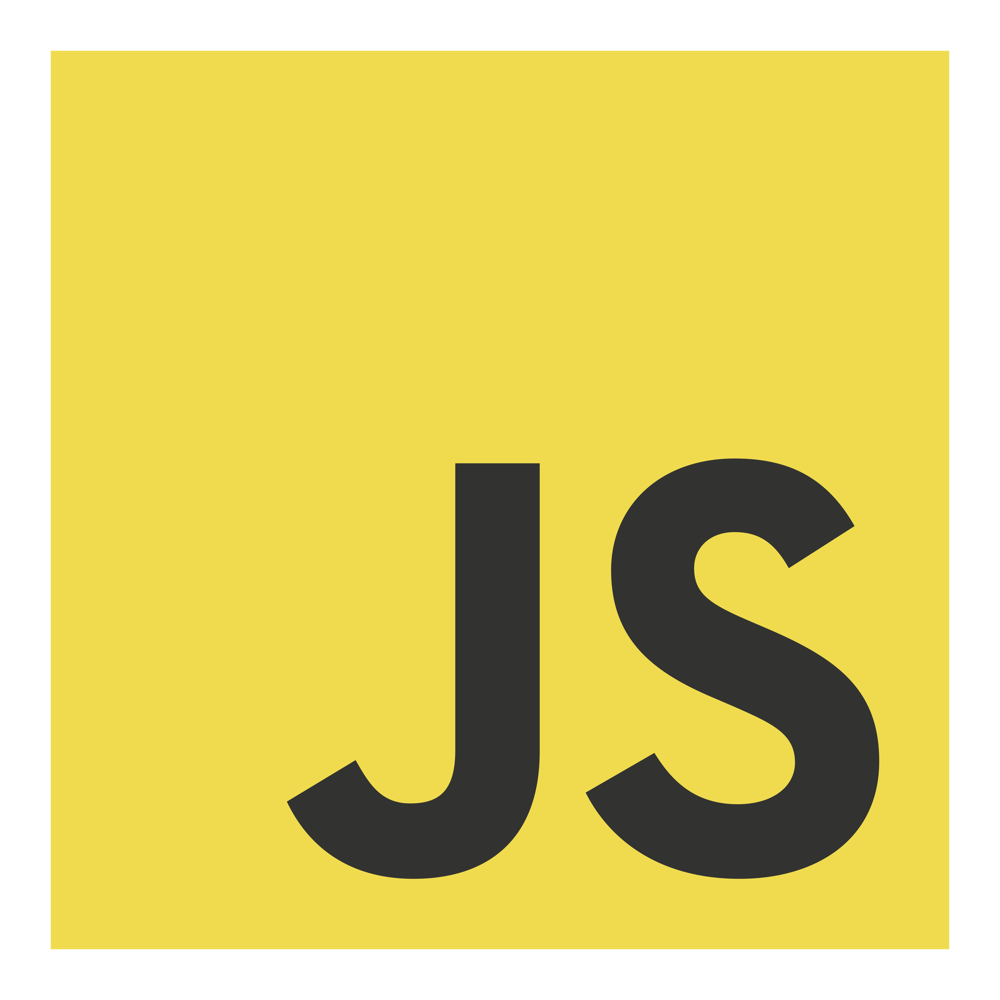</a>

## Technologies Used

<a href = '#'>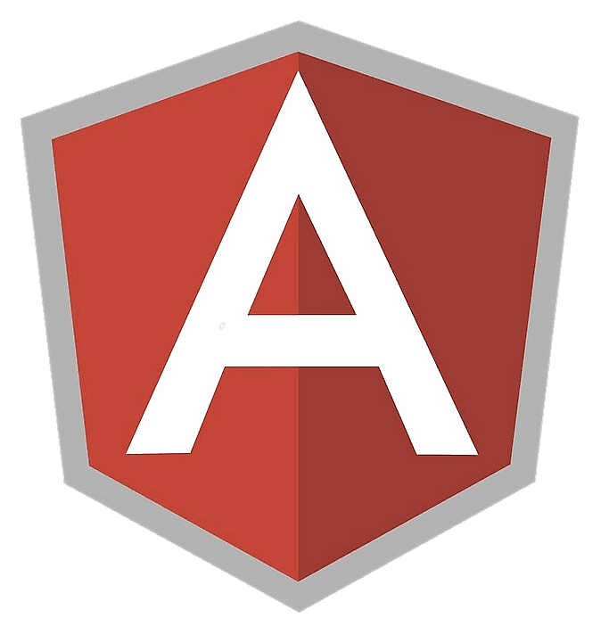</a>
<a href = '#'>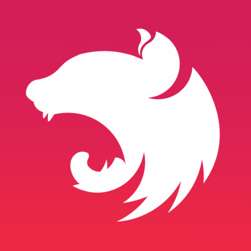</a>
<a href = '#'>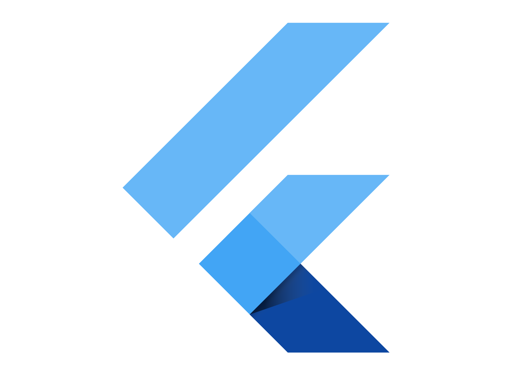</a>
<a href = '#'>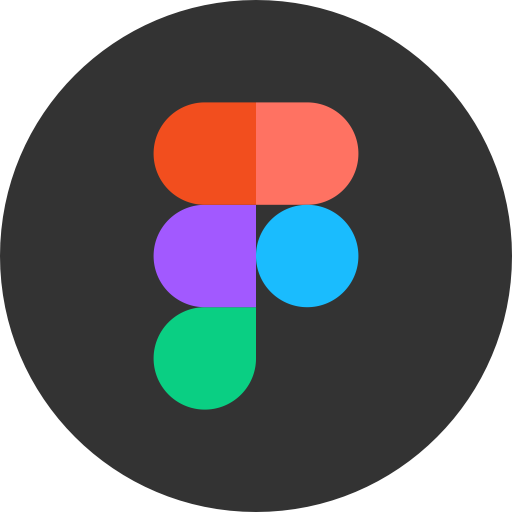</a>
<a href = '#'>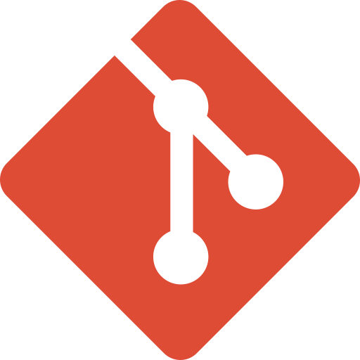</a>
<a href = '#'>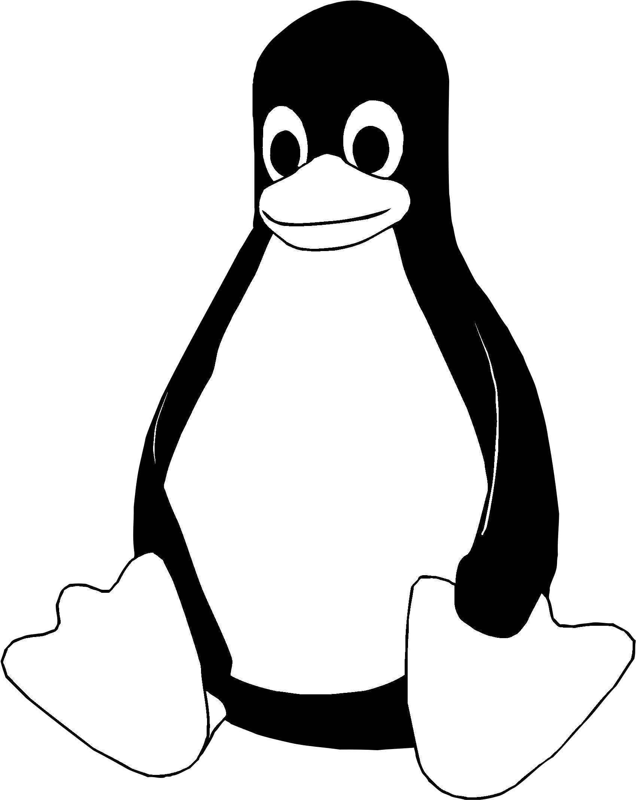</a>

